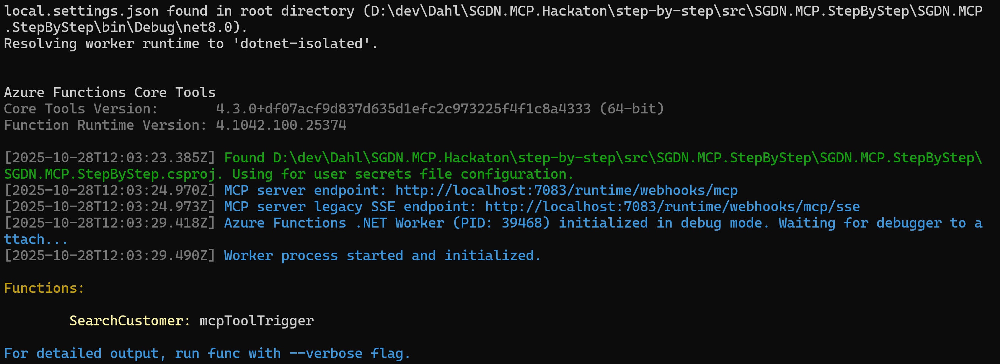
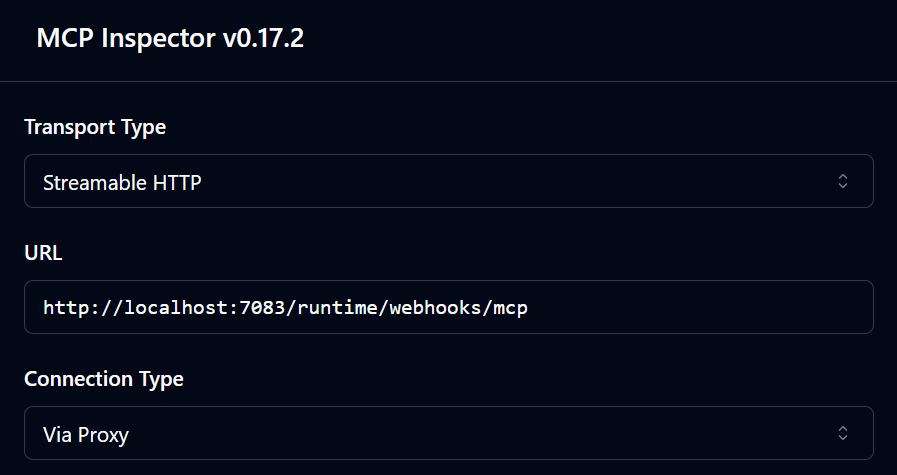
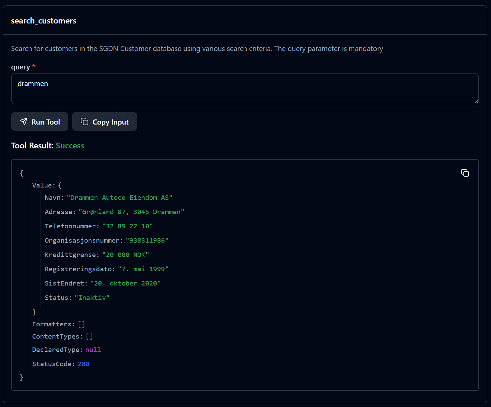
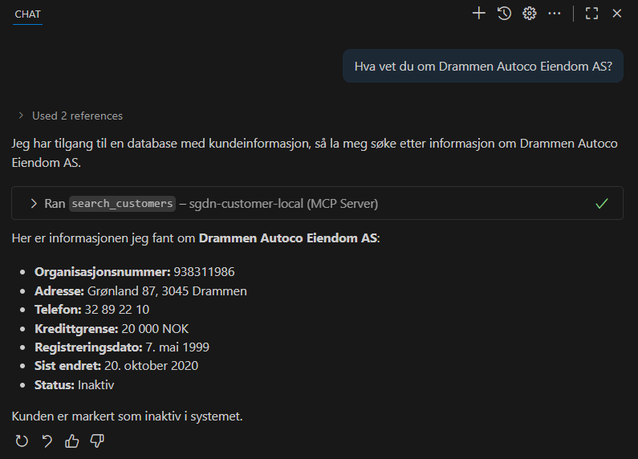
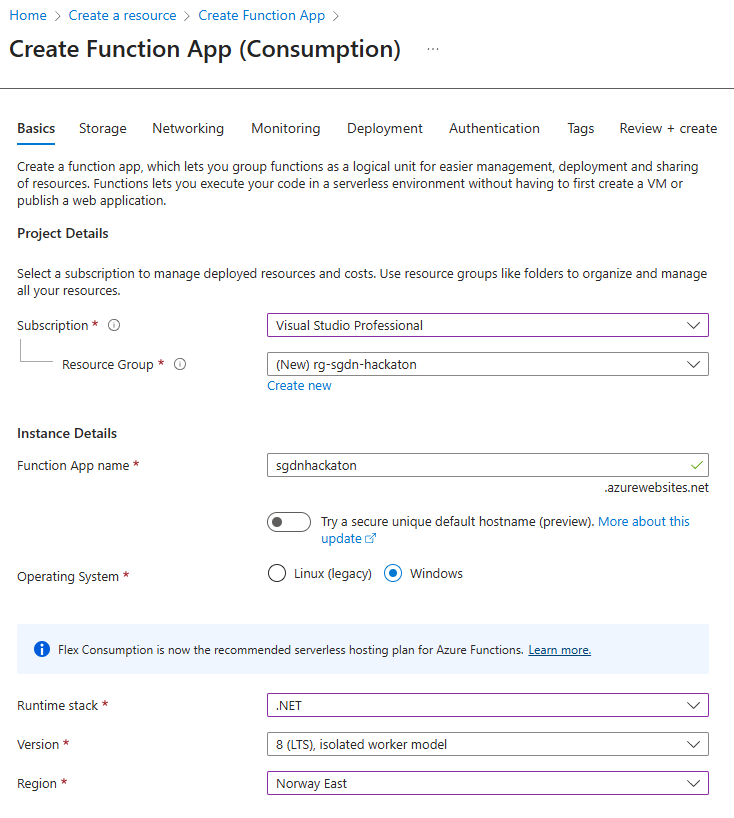
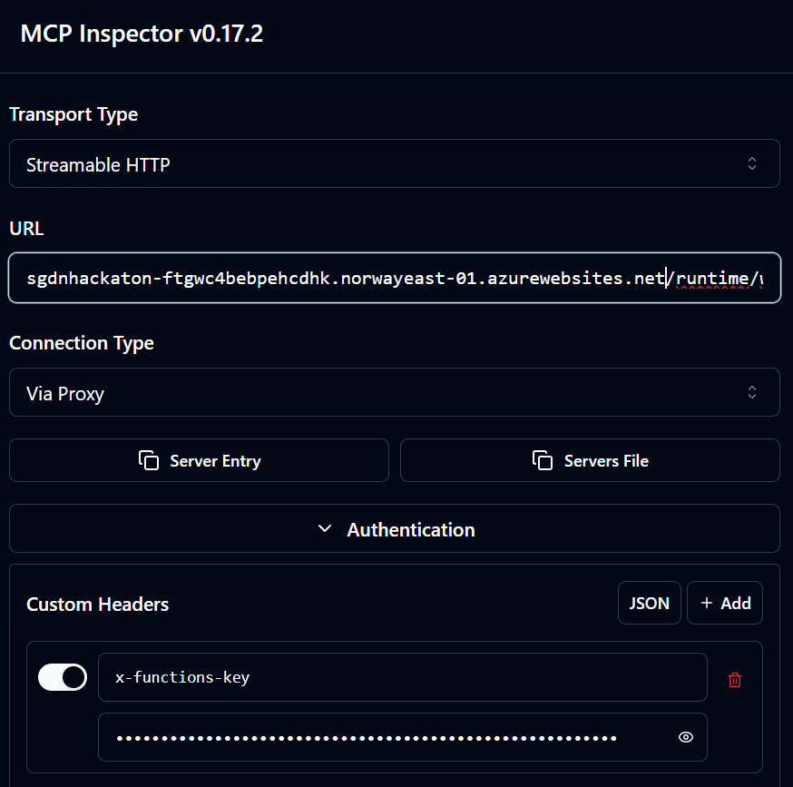
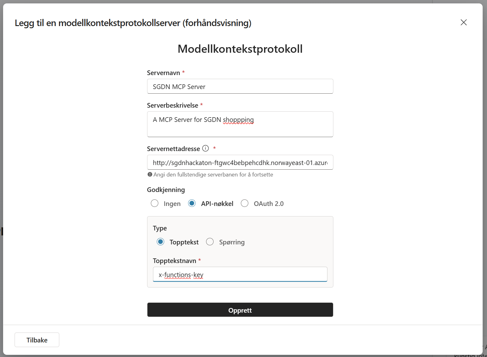

# Step by Step : .NET MCP-server in Azure

## New project

1.  Add Function App Project
    - Add new Function App project in Visual Studio
        - Name: SGDN.MCP.<your-project-nam>
        - Worker: .NET 8.0 Isolated
        - Trigger: Empty

2. Add Azure Function

    * Add a new folder called Tools
    * Add new file; CustomerSearchTool, in the Tools folder

    ```csharp 
        [Function("SearchCustomer")]
        public async Task<IActionResult> Run(
            [HttpTrigger(AuthorizationLevel.Function, "get", Route = "search-customer")] HttpRequestData req)
        {
            string? query = req.Query["query"];

            return new OkObjectResult($"You searched for customer: {query}");
        }
    ```
    
3. Test Function

    * Test that Function in webbrowser, Postman or similar :

            http://localhost:7083/api/search-customer?query=test

4. Add Azure Functions MCP Nuget-package

        dotnet add package Microsoft.Azure.Functions.Worker.Extensions.Mcp --version 1.0.0-preview.7

5. Use the McpToolTrigger

    * Remove the HttpTriger
    * Add a McpToolTrigger

        ```csharp 
            [Function("SearchCustomer")]
            public async Task<IActionResult> Run(
                [McpToolTrigger("search_customers", "Search for customers in the SGDN Customer database using various search criteria. The query parameter is mandatory")] ToolInvocationContext context,
                [McpToolProperty("query", "string", "Mandatory! Search query string to find customers by name, organization number, or other fields.", true)] string query)
            {
                return new StatusCodeResult(StatusCodes.Status200OK);
            }      
        ```
5. Add a mock response

    * Change "return new StatusCodeResult(StatusCodes.Status200OK);"" to

        ```csharp 
            return new OkObjectResult(new
            {
                Navn = "Drammen Autoco Eiendom AS",
                Adresse = "Grønland 87, 3045 Drammen",
                Telefonnummer = "32 89 22 10",
                Organisasjonsnummer = "938311986",
                Kredittgrense = "20 000 NOK",
                Registreringsdato = "7. mai 1999",
                SistEndret = "20. oktober 2020",
                Status = "Inaktiv"
            });   
        ```

6. Enable MCP Tool Metadata

    * In program.cs
    
        ```csharp 

            builder.EnableMcpToolMetadata();

            builder
                .ConfigureMcpTool("search_customers")
                .WithProperty("query", "string", "Mandatory! Search query string to find customers by name, organization number, or other fields.", required: true);

        ``` 

7. Run the MCP server

    * Using Visual Studio or dotnet run
    * Should see this:

        
        
        
8. Test the MCP server locally (option 1)

    * Use MCP Inspector
        - Go to and follow the instructions for installation: 
        https://modelcontextprotocol.io/docs/tools/inspector
    * Configure you MCP:

        

    * Test the tool:

        

8. Test the MCP server locally (option 2, more fun)


    * Requires Github Copilot or similar
    * Open a empty folder in VSCode 
    * Add a .vscode folder
    * Add a mcp.json file to the folder
    * Add this content:    

        ```json
            {
                "servers": {
                    "sgdn-customer-local": {
                        "type": "sse",
                        "url": "http://localhost:7083/runtime/webhooks/mcp/sse",
                    }
                }
            }       
        ``` 
    * Start the MCP-server

        

    * Make sure Github Copilot is in Agent mode

        

    * Ask about Drammen Autoco Eiendom AS

        

9. Create Azure Function App

    * Go to the Azure Portal
    * Create a new Azure Function App
        - Make sure to run on Windows
            - Chosing Flex Consumption will default to Linux, so choose the older Consumption model:
            
        - Use proper naming and use .NET 8 Isolated 

            
    * Click "Get publish profile" and download the profile in the newly created Azure Function App

10. Publish to Azure Function App
    * In Visual Studio, right-click solution and click Publish...
    * Select Import profile and select the profile you downloaded
    * Click Publish

12. Test the Remote MCP Server

    * Same as for local testing
    * Change to remote url
    * Get the "API Key" (mcp_extention) from the Azure Function App:

        

    * Add the key as a Header named "x-functions-key" in MCP Inspector

        

    * Or in mcp.json in VSCode:

        

15. Create a Agent in Copilot Studio:

    * Go to https://copilotstudio.microsoft.com/
    * Click "New" -> "New Agent"
    * Give the Agent a descriptive name
    * Click "Create"
    * Go to "Tools" -> "Add a Tool"
    * Click "Create new tool"
    * Select "Model Context Protocol"
    * Add correct configuration

        

        - The server url must be without "sse" in the end, eg. <your server>/runtime/webhooks/mcp
        - Add API Key (header) named "x-functions-key"
        - Click "Create"
    * Click "Connect" - "Create connection"

        
        - Add the key (App Keys -> mcp_extention) from the Azure Function App
    * Make sure the connection is ok
    * Click "Add to Agent"

16. Test the Agent in the Chat window in Copilot Studio

    


17. Add Agent to Teams or M365 Copilot

    * In Copilot Studio, go to Channels
    * Select Teams & Microsoft 365 Copilot
    * Click "Add to channel"
    * Allow "Publish"
    * Select "See Agent in Teams" or "MS 365"
    * Click "Add agent"
    * Test the agent by asking about "Drammen Autoco"

14. Congratulations! You've made a Agent using MCP Server!

    * Now, extend you MCP-server/code to use SGDN-services to solve the case